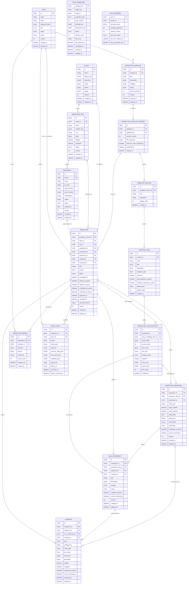

# ER Diagram - FieldOps

```mermaid
erDiagram
    CLIENT {
        UUID id PK
        string name
        string legal_name
        string document
        string email
        string phone
        enum status
        int version
        datetime created_at
        datetime updated_at
    }
    INSPECTION_SITE {
        UUID id PK
        UUID client_id FK
        string name
        string address_line
        string city
        string state
        decimal latitude
        decimal longitude
        enum status
        int version
        datetime created_at
        datetime updated_at
    }
    EQUIPMENT {
        UUID id PK
        UUID site_id FK
        string name
        string qr_code
        string asset_number
        string serial_number
        string manufacturer
        string model
        enum status
        date installed_at
        int version
        datetime created_at
        datetime updated_at
    }
    USER {
        UUID id PK
        string name
        string email
        string password_hash
        enum role
        enum status
        string phone
        int version
        datetime created_at
        datetime updated_at
    }
    INSPECTION_TEMPLATE {
        UUID id PK
        UUID created_by FK
        string title
        string description
        string category
        enum status
        int current_version
        int version
        datetime created_at
        datetime updated_at
    }
    INSPECTION_TEMPLATE_VERSION {
        UUID id PK
        UUID template_id FK
        UUID published_by FK
        int version_number
        string title_snapshot
        boolean active_for_new_inspections
        datetime published_at
        datetime created_at
    }
    TEMPLATE_SECTION {
        UUID id PK
        UUID template_version_id FK
        string title
        string description
        int display_order
        datetime created_at
    }
    TEMPLATE_ITEM {
        UUID id PK
        UUID section_id FK
        string code
        string title
        string description
        enum response_type
        boolean required
        boolean obs_required_on_failure
        boolean evidence_required_on_failure
        JSON options_json
        int display_order
        datetime created_at
    }
    INSPECTION {
        UUID id PK
        UUID template_version_id FK
        UUID client_id FK
        UUID site_id FK
        UUID equipment_id FK
        UUID technician_id FK
        UUID supervisor_id FK
        UUID created_by FK
        UUID canceled_by FK
        string title
        enum priority
        enum status
        datetime scheduled_for
        datetime started_at_device
        datetime started_at_server
        datetime completed_at_device
        datetime submitted_at_server
        datetime approved_at
        datetime canceled_at
        string canceled_reason
        int version
        datetime created_at
        datetime updated_at
    }
    INSPECTION_ITEM_SNAPSHOT {
        UUID id PK
        UUID inspection_id FK
        UUID source_template_item_id FK
        string section_title
        int section_order
        string item_code
        string item_title
        enum response_type
        boolean required
        JSON rules_json
        JSON options_json
        int item_order
        datetime created_at
    }
    INSPECTION_RESPONSE {
        UUID id PK
        UUID inspection_id FK
        UUID inspection_item_id FK
        UUID answered_by FK
        string value_text
        decimal value_number
        boolean value_boolean
        date value_date
        JSON value_json
        string observation
        enum conformity
        datetime answered_at_device
        datetime server_received_at
        int version
        datetime created_at
        datetime updated_at
    }
    NON_CONFORMITY {
        UUID id PK
        UUID inspection_id FK
        UUID inspection_item_id FK
        UUID response_id FK
        UUID created_by FK
        string title
        string description
        enum severity
        enum status
        datetime created_at_device
        datetime server_received_at
        int version
        datetime created_at
        datetime updated_at
    }
    EVIDENCE {
        UUID id PK
        UUID inspection_id FK
        UUID response_id FK
        UUID non_conformity_id FK
        UUID created_by FK
        enum type
        string storage_key
        string mime_type
        long size_bytes
        string checksum
        string description
        decimal latitude
        decimal longitude
        datetime captured_at_device
        datetime server_received_at
        datetime uploaded_at
        datetime created_at
    }
    INSPECTION_REVIEW {
        UUID id PK
        UUID inspection_id FK
        UUID reviewer_id FK
        enum decision
        string reason
        string comments
        int review_cycle
        datetime reviewed_at
        datetime created_at
    }
    AUDIT_EVENT {
        UUID id PK
        UUID inspection_id FK
        UUID actor_id FK
        string action
        string entity_type
        UUID entity_id
        JSON previous_value_json
        JSON new_value_json
        JSON metadata_json
        string request_id
        string device_id
        datetime occurred_at
        datetime device_occurred_at
    }
    SYNC_OPERATION {
        UUID operation_id PK
        string entity_type
        UUID entity_id
        enum operation_type
        int base_version
        JSON payload_json
        JSON dependency_ids
        enum status
        int attempt_count
        string last_error
        datetime last_attempt_at
        datetime completed_at
        datetime created_at
        datetime updated_at
    }
    SYNC_METADATA {
        UUID user_id PK
        UUID device_id
        string last_pull_cursor
        int pending_operations
        int schema_version
        enum last_sync_result
        datetime last_sync_started_at
        datetime last_successful_sync
    }

    CLIENT ||--o{ INSPECTION_SITE : "possui"
    INSPECTION_SITE ||--o{ EQUIPMENT : "contém"
    USER ||--o{ INSPECTION_TEMPLATE : "cria"
    INSPECTION_TEMPLATE ||--o{ INSPECTION_TEMPLATE_VERSION : "versiona"
    INSPECTION_TEMPLATE_VERSION ||--o{ TEMPLATE_SECTION : "contém"
    TEMPLATE_SECTION ||--o{ TEMPLATE_ITEM : "contém"
    INSPECTION_TEMPLATE_VERSION ||--o{ INSPECTION : "usado em"
    CLIENT ||--o{ INSPECTION : "vinculada a"
    INSPECTION_SITE ||--o{ INSPECTION : "realizada em"
    EQUIPMENT ||--o{ INSPECTION : "inspecionado em"
    USER ||--o{ INSPECTION : "técnico / supervisor"
    INSPECTION ||--o{ INSPECTION_ITEM_SNAPSHOT : "gera snapshot"
    TEMPLATE_ITEM ||--o{ INSPECTION_ITEM_SNAPSHOT : "origina"
    INSPECTION_ITEM_SNAPSHOT ||--o| INSPECTION_RESPONSE : "respondida por"
    INSPECTION ||--o{ INSPECTION_RESPONSE : "possui"
    INSPECTION_RESPONSE ||--o{ NON_CONFORMITY : "origina"
    INSPECTION ||--o{ NON_CONFORMITY : "registra"
    INSPECTION_ITEM_SNAPSHOT ||--o{ NON_CONFORMITY : "associada a"
    INSPECTION_RESPONSE ||--o{ EVIDENCE : "comprovada por"
    NON_CONFORMITY ||--o{ EVIDENCE : "comprovada por"
    INSPECTION ||--o{ EVIDENCE : "contém"
    INSPECTION ||--o{ INSPECTION_REVIEW : "revisada em"
    USER ||--o{ INSPECTION_REVIEW : "revisa"
    INSPECTION ||--o{ AUDIT_EVENT : "auditada"
    USER ||--o{ AUDIT_EVENT : "realiza"
```
